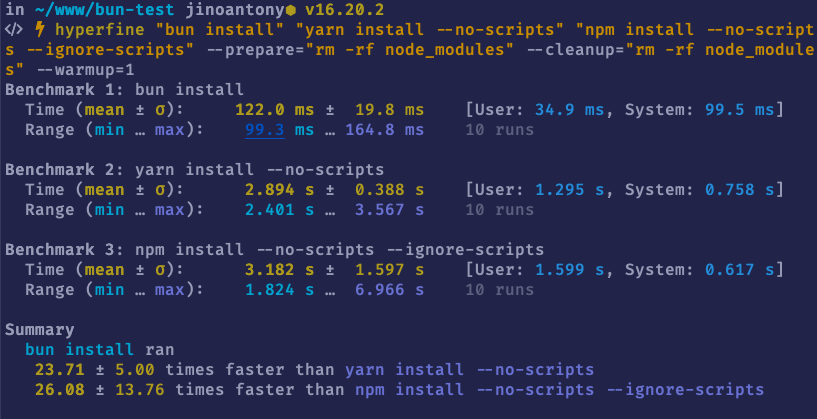

New frameworks and libraries are not a new thing in the Javascript ecosystem. In fact, new JS libraries are released almost every week! So what makes Bun different from other libraries/frameworks? Let's find out.

## What is BunJs?

[Bun](https://bun.sh) is a "fast all-in-one javascript runtime". It is similar to Node or Deno. It was created by [Jarred Sumner](https://twitter.com/jarredsumner). Bun started out as a javascript webserver and later evolved into being a complete rewrite of the javascript ecosystem.

> At its core is the Bun runtime, a fast JavaScript runtime designed as a drop-in replacement for Node.js. It's written in Zig and powered by JavaScriptCore under the hood, dramatically reducing startup times and memory usage.

Bun was built from scratch to focus on three main things:

- Start fast
- Provide new levels of performance
- Being a great and complete tool

Bun is written in [ZIG](https://ziglang.org/) language and uses the JavascriptCore engine instead of V8 which was used in node and deno. It is designed as a drop-in replacement for nodejs.

## Why BunJs?

Let's take a look into the why part of bun, why it exists? 

According to the official [site](https://bun.sh/),

> The goal of Bun is to run most of the world's server-side JavaScript and provide tools to improve performance, reduce complexity, and multiply developer productivity.

So you can say Bun is an all-in-one package for JavaScript development. This makes Bun stand out from its alternatives like node and deno where we need some external tools/packages for the development.

The built-in features offered by Bun are:

- Javascript runtime
- Package manager
- Test runner
- Transpiler/Bundler
- Typescript & JSX Support
- env support
- Sqlite client

## Blazing Fast

The standout feature of bun is its blazing fast speed compared to its alternatives. It is said to be [4x times faster than node.js](https://twitter.com/jarredsumner/status/1499225725492076544). We can verify this ourselves with a simple script.

The following code is a simple script to create an http server which listens on port 3000
```javascript
const http = require('node:http');

const server = http.createServer((req, res) => {
    res.end('Hello World!');
});

server.listen(3000);
```

Let's benchmark this using apache bench

```shell
ab -k -c 20 -n 250 "http://localhost:3000/"
```

It produces the following output

```text
Concurrency Level:      20
Time taken for tests:   0.107 seconds
Complete requests:      250
Failed requests:        0
Keep-Alive requests:    0
Total transferred:      21750 bytes
HTML transferred:       3000 bytes
Requests per second:    2330.22 [#/sec] (mean)
Time per request:       8.583 [ms] (mean)
Time per request:       0.429 [ms] (mean, across all concurrent requests)
Transfer rate:          197.98 [Kbytes/sec] received

Connection Times (ms)
              min  mean[+/-sd] median   max
Connect:        0    1   0.5      0       4
Processing:     1    8   3.8      7      19
Waiting:        0    4   2.8      4      14
Total:          2    8   3.7      8      19
```

Now let's run the same script using Bun. We don't need to make any changes in the script since Bun supports most of the node libraries. We can replace the start command form `node server.js` to `bun server.js` and it will just work.

```text
Concurrency Level:      20
Time taken for tests:   0.051 seconds
Complete requests:      250
Failed requests:        0
Keep-Alive requests:    0
Total transferred:      32000 bytes
HTML transferred:       3000 bytes
Requests per second:    4945.01 [#/sec] (mean)
Time per request:       4.044 [ms] (mean)
Time per request:       0.202 [ms] (mean, across all concurrent requests)
Transfer rate:          618.13 [Kbytes/sec] received

Connection Times (ms)
              min  mean[+/-sd] median   max
Connect:        0    1   0.6      1       3
Processing:     0    3   1.9      2       8
Waiting:        0    3   1.8      2       8
Total:          2    4   1.9      3       8
```

From the benchmark result we can clearly see bun outperfoms nodejs in speed. Bun can handle 2x more requests/sec than node with node's http server.

Now let's benchmark Bun with its own server.

```javascript
export default {
    port: 3000,
    fetch(req) {
        return new Response('Hello world!');
    }
}
```

It's pretty simple to create an http server in Bun. The script needs to make a default export with an object with a `port` and `fetch` function, it will automatically creates an http server listening on the specified port.

```text
Concurrency Level:      20
Time taken for tests:   0.033 seconds
Complete requests:      250
Failed requests:        0
Keep-Alive requests:    0
Total transferred:      32000 bytes
HTML transferred:       3000 bytes
Requests per second:    7585.18 [#/sec] (mean)
Time per request:       2.637 [ms] (mean)
Time per request:       0.132 [ms] (mean, across all concurrent requests)
Transfer rate:          948.15 [Kbytes/sec] received

Connection Times (ms)
              min  mean[+/-sd] median   max
Connect:        0    1   0.5      1       2
Processing:     0    2   0.8      1       4
Waiting:        0    1   0.8      1       4
Total:          1    2   0.9      2       5
```

Bun's own server is blazing fast and handles 3x requests/sec more than node's server.

## Package Manager

Let's take a look at Bun's package manager, which is also nodejs compatible. It can be used as a standalone tool for existing nodejs applications.

To install all dependencies of a project using the bun package manager we can use the following command.

```shell
bun install
```

To install specific packages:
```shell
bun add package-name
```

We can run a benchmark test on Bun's package manager against `yarn` and `npm`. The benchmark is run for the following package.json.

```json
{
  "name": "Bun-test",
  "private": true,
  "dependencies": {
    "express": "4.18.2"
  }
}
```

It have only one dependency `express`.

Running benchmark produced the following results



As per the benchmark results `bun install` is 26x times faster than `npm install` and 23x times faster than `yarn install`

## Future of Bun

The future of Bun looks promising. The JavaScript community is really excited about the new kid in town. The success of any new technology depends on community adaptation. People usually don't like to change things they have the most comfort in unless the change brings new levels of comfort. Similar is the case with technology. But in the case of Bun, the features, especially the speed, might be a huge factor in its adaptation. Also, even if we don't need to replace Node.js entirely, we can still use Bun as a package manager, test runner, transpiler, etc.

Will Bun replace Nodejs? Well, we need to find out, but I think Bun is in the right way for that!